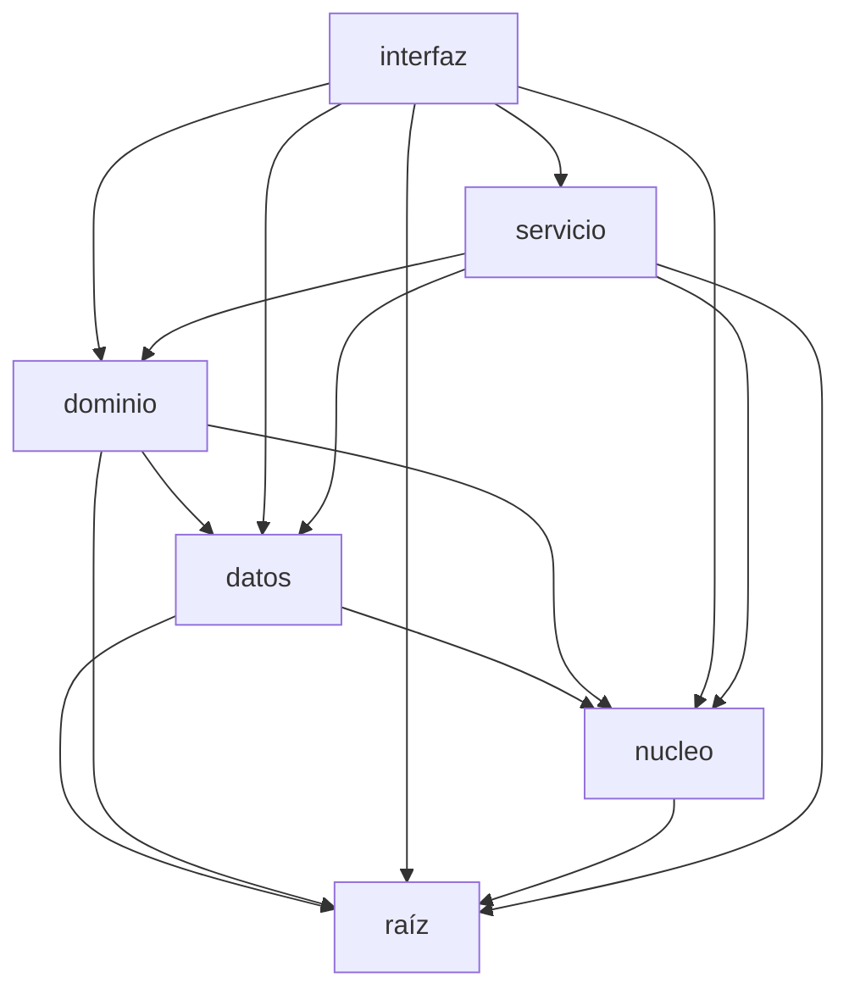

# Mapa de módulos — apu_tool/

> Autogenerado por `scripts/mapa_arquitectura.py` en cada commit, desde los imports reales de `apu_tool/`. No editar — se regenera solo.

## Dependencias entre paquetes

## nucleo/ — tipos y utilidades puras

| Archivo | Responsabilidad |
| --- | --- |
| `models.py` | Estructuras de datos del dominio. |
| `redondeo.py` | Redondeo a la unidad (peso) en multiplicaciones monetarias. |
| `relevancia.py` | Orden por relevancia de una búsqueda por texto (capa núcleo, sin dependencias). |
| `texto.py` | Normalización de texto compartida (capa núcleo, sin dependencias). |

## datos/ — persistencia (incluye datos/pg/, backend Postgres)

| Archivo | Responsabilidad |
| --- | --- |
| `almacen.py` | Fachada de persistencia. Agrupa los repositorios SQLite/Postgres (precios, apus, corridas, perfiles). |
| `apus_db.py` | Acceso a apus.db (SQLite): biblioteca histórica de APUs (composición + rendimiento + turno). |
| `auditoria_db.py` | Acceso SQLite a la tabla `auditoria` (vive en seguridad.db, junto a perfiles). |
| `carpetas_db.py` | Acceso a la tabla `carpeta` (vive en corridas.db). Implementa RepositorioCarpetas. |
| `correcciones.py` | Correcciones de código aplicadas al semillar (normalización mínima). |
| `corridas_db.py` | Acceso a corridas.db (SQLite): estado de aplicación de un armado en progreso. |
| `migracion_pg.py` | Migración de catálogo SQLite → Postgres (Supabase). Corridas NO se migran. |
| `perfiles_db.py` | Acceso SQLite a la tabla perfiles (identidad + rol). Implementa RepositorioPerfiles. |
| `pg/apus_pg.py` | Backend Postgres de APUs. Implementa RepositorioApus. Port 1:1 de apus_db.py. |
| `pg/auditoria_pg.py` | Backend Postgres de auditoría (seguridad.auditoria). Implementa RepositorioAuditoria. |
| `pg/carpetas_pg.py` | Backend Postgres de carpetas. Implementa RepositorioCarpetas. Port de carpetas_db.py. |
| `pg/conexion.py` | Pool de conexiones Postgres (Supabase) para el backend de nube. |
| `pg/corridas_pg.py` | Backend Postgres de corridas. Implementa RepositorioCorridas. Port de corridas_db.py. |
| `pg/perfiles_pg.py` | Acceso Postgres a seguridad.perfiles. Implementa RepositorioPerfiles. Port de perfiles_db. |
| `pg/precios_pg.py` | Backend Postgres de precios. Implementa RepositorioPrecios. |
| `precios_db.py` | Acceso a precios.db (SQLite): catálogo de insumos y libro de precios. |
| `repositorio.py` | Contratos de almacenamiento, separados por dominio. |
| `seed.py` | Semillado (fuente de verdad): importa el Excel UNA vez a precios.db + apus.db. |

## dominio/ — motor de negocio

| Archivo | Responsabilidad |
| --- | --- |
| `ai_assist.py` | Capa de IA acotada para decidir la ESTRUCTURA de los APUs. |
| `alertas.py` | Alertas de costeo: motivos por los que un ítem necesita revisión de costo. |
| `assemble.py` | Orquestador del pipeline por ítem. |
| `compose.py` | Recuperación de insumos candidatos para la composición generativa. |
| `cruce.py` | Resolución del cruce insumo-de-APU -> insumo-de-catálogo, por código + nombre. |
| `integridad.py` | Chequeo de integridad del vínculo APU -> insumo (que cruza las dos bases). |
| `licitacion.py` | Lectura de la lista de licitación (entrada) y generación de un ejemplo. |
| `matching.py` | Matcher determinístico de actividades contra el catálogo de APUs. |
| `pipeline.py` | Funciones de alto nivel que orquestan el pipeline completo. |
| `presupuesto.py` | Lectura del presupuesto oficial por capítulos (hoja FOR 1-PPTO OFICIAL). |
| `pricing.py` | Motor de precios determinístico. |
| `privacy.py` | Frontera de privacidad de precios. |
| `report.py` | Generación del cuadro resumen (salida en Excel). |
| `report_categorizado.py` | Cuadro resumen agrupado por capítulos del presupuesto. |
| `transporte.py` | Desviaciones de un proyecto respecto de la biblioteca de APUs. |

## servicio/ — API web (FastAPI)

| Archivo | Responsabilidad |
| --- | --- |
| `ajustes.py` | Ajustes puntuales de composición por proyecto: las excepciones que decide el |
| `app.py` | App FastAPI: monta /api y, si existe el build, sirve el frontend (web/dist). |
| `apus.py` | Lectura de la biblioteca de APUs (para la página de APUs). |
| `auditoria.py` | Servicio de auditoría: helper transaccional para registrar eventos y lectura paginada. |
| `auth.py` | Autenticación (Supabase Auth) y autorización (RBAC) para la API. |
| `autoria.py` | Lógica de servicio para AGREGAR a la base: insumos y APUs nuevos. |
| `carpetas.py` | Servicio de carpetas: reglas de negocio (profundidad máx. 2, unicidad de |
| `corridas.py` | Lógica de la capa de servicio para las corridas (armado web). |
| `dependencias.py` | Inyección de dependencias de la API: el Almacen vive en app.state. |
| `esquemas.py` | DTOs del contrato HTTP. Las respuestas de cuadro/ítems se devuelven como dict. |
| `insumos.py` | Lógica de servicio para la edición de insumos (precio + fuente). |
| `insumos_ocultos.py` | Migración: oculta (no borra) del catálogo de insumos los códigos que son un eco |
| `limites.py` | Endurecimiento de tráfico: límite de tamaño de subida (aquí) y rate limiting (Task 6). |
| `listas.py` | Lógica de servicio para las listas de precios (tarifas). |
| `plantillas.py` | Generación de plantillas .xlsx para los importadores (APUs, insumos, precios). |
| `presencia.py` | Quién está usando la app ahora mismo. |
| `rutas.py` | Endpoints de la API. Delgados: validan y delegan en apu_tool.servicio.corridas. |
| `seguridad_headers.py` | Middleware de cabeceras de seguridad (HSTS, nosniff, X-Frame-Options, Referrer-Policy, CSP). |
| `subapus.py` | Migración: marca como sub-APU los componentes cuyo código es un APU existente. |
| `supabase_admin.py` | Cliente de la Admin API de Supabase Auth, tras una interfaz (fake en tests). |
| `transporte.py` | Servicio de distancias de acarreo por proyecto y de clasificación de la biblioteca. |
| `usuarios.py` | Lógica de gestión de usuarios (solo-Admin). Mutaciones sensibles: ganchos para |

## interfaz/ — puntos de entrada (CLI, GUI)

| Archivo | Responsabilidad |
| --- | --- |
| `cli.py` | Interfaz de línea de comandos. |
| `gui.py` | Interfaz gráfica (tkinter) del armador de APUs. |

## raíz — módulos transversales sueltos

| Archivo | Responsabilidad |
| --- | --- |
| `config.py` | Configuración central y rutas del proyecto. |
